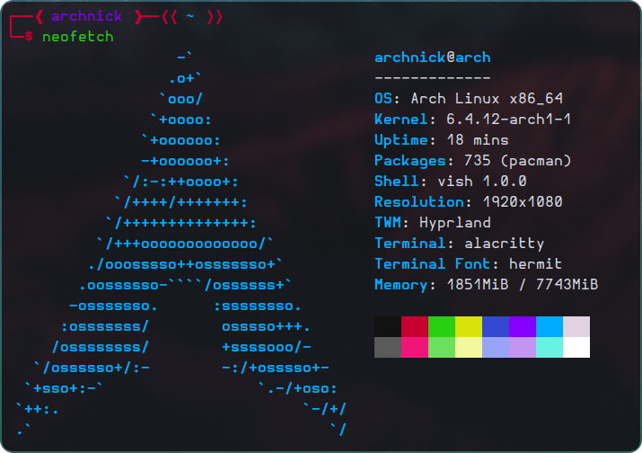
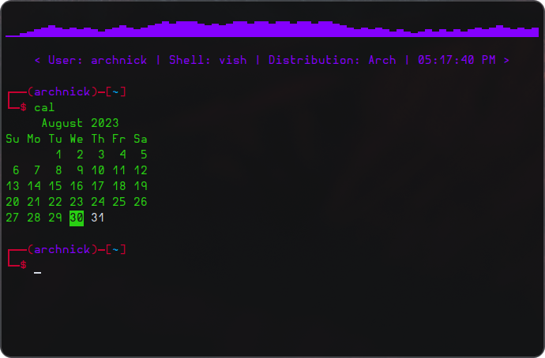

    

Simple Linux shell made with C++ by Nick Kipshidze.

# Running the code

1. Clone the GitHub repository: `git clone https://github.com/NickKipshidze/cpp-vish`
2. **cd** into the project directory: `cd cpp-vish`
3. Build the project using **makefile**: `make`
4. Run the binary: `./vish`

# Preview

# Todo

- Add some **real** configuration
- Add command history
- Fix problem with echoing environment variables
- Add math evaluation feature

> #### Note
> This shell supports GNU/Linux only (obviously)