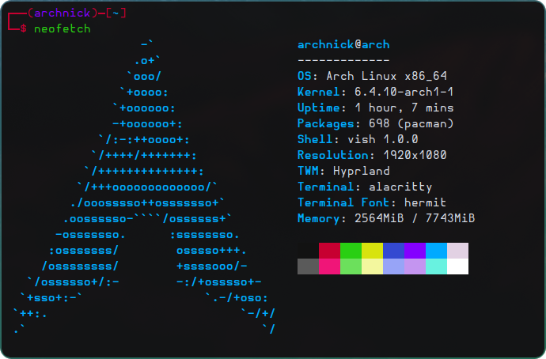
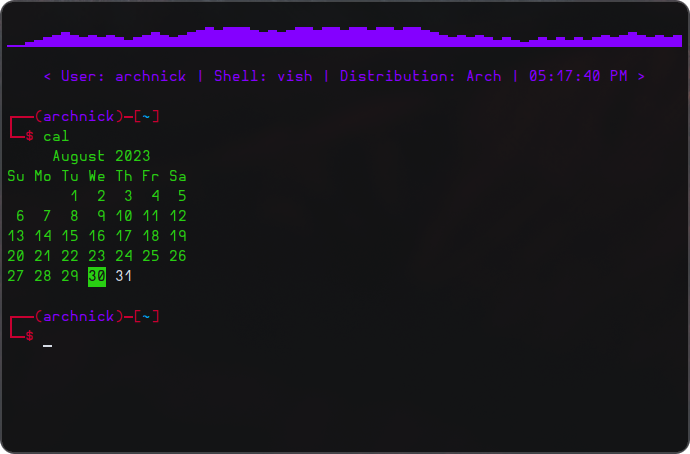

# VISH
Simple Linux shell made with C++ by Nick Kipshidze.

# Preview

# Todo

- Add some **real** configuration
- Add command history
- Fix problem with echoing environment variables
- Add math evaluation feature
